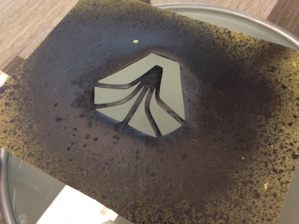
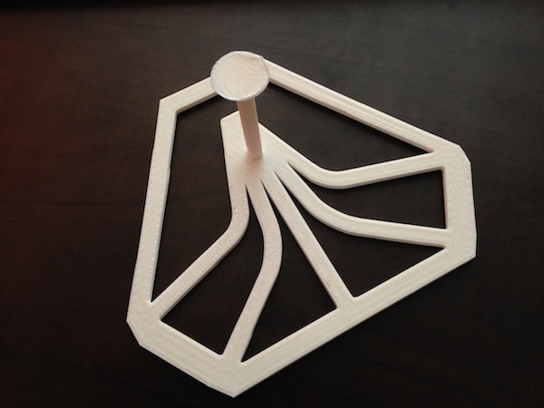
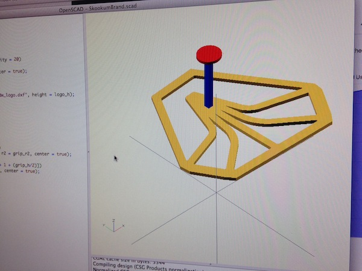
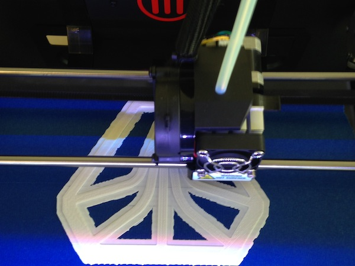
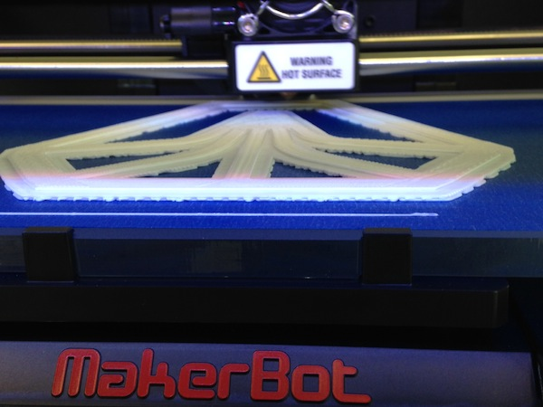
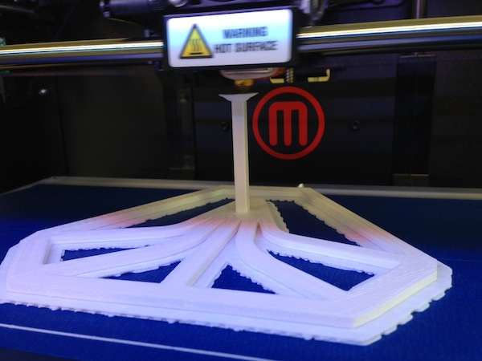

# SDW 3D Stencil

This stencil is made of [Polylactic Acid](http://store.makerbot.com/filament#pla)!

## Why

Our marketing gurus wanted to send out some cool swag to our clients. So they came up with the idea of spray painting our logo onto the envelopes. So the Skookum Design Team came up with a stencil made of paper.

But that paper stencil became flimsy and staurated with paint. So we decided to use our MakerBot Replicator2 to make one ourselves that would be more durable and, frankly, _cooler_.

## How

First, grab yourself a copy of [OpenSCAD](http://www.openscad.org/). It's a 3D modeling tool that uses programming to generate the 3D objects.

Then open the `SkookumStencil.scad` file in this repository to start playing with the file.

## Turning 2D into 3D

It's relatively easy to turn your 2D logo into a 3D object with OpenSCAD. OpenSCAD recognizes the [`dxf`](http://en.wikipedia.org/wiki/AutoCAD_DXF) file format. In order to turn something like an `svg` into a `dxf` there's a few things you have to do:

1. Open your vector file in an image editor and export as an EPS file.
2. Install the [`pstoedit`](http://www.pstoedit.net/) command line utility on your computer. If you're on a Mac, just use Homebrew and run `brew install pstoedit`.
3. Run this command: `pstoedit -dt -f dxf:-polyaslines infile.eps outfile.dxf`

Now you have a `dxf` file that can be read into OpenSCAD and extruded into a 3D shape!

[Check out the OpenSCAD documentation here.](http://en.wikibooks.org/wiki/OpenSCAD_User_Manual/The_OpenSCAD_Language)

## More Photos

Just because we like photos.

